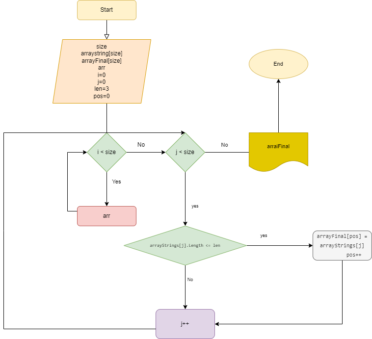

# Итоговая работа

## Задача
Написать программу, которая из имеющегося массива строк формирует массив из строк, длина которых меньше либо равна 3 символа. Первоначальный массив можно ввести с клавиатуры, либо задать на старте выполнения алгоритма. При решение не рекомендуется пользоваться коллекциями, лучше обойтись исключительно массивами.

## Алгоритм решения
 1 создали строковый массив, заполняемый пользователем с клавиатуры Х раз
 2 проходим по стартовому массиву в цикле и проверяем, подходит ли элемент условию "длина символов <= 3". Если элемент подходит под данное условие, то мы добавляем его в новый массив, используя при этом дополнительный счетчик, чтобы элементы в новом массиве заполнялись последовательно.
 3 напечатали массив\массивы, которые не подходят под условие длина <= 3

 # Дополнительная информация
 добавили блок-схему 
 